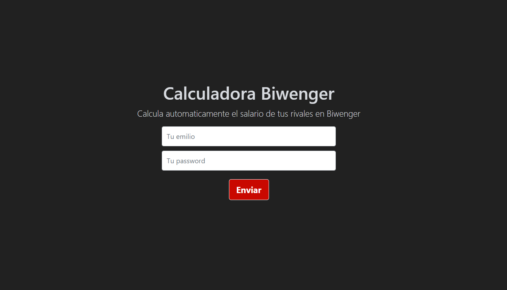

# Calculadora salarial Biwenger

_Proyecto de API sobre NodeJS + Express que calcula el salario de los rivales de tu liga en Biwenger_

## Comenzando 🚀

_Para instalar la herramienta en local debes tener instalado NPM y NodeJs en tu sistema._

npm install

npm run start

